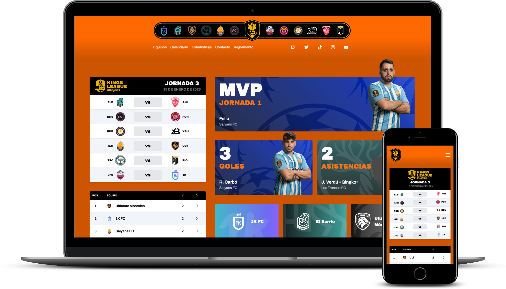

<h1>👑 Kings League Infojobs Project ⚽️</h1>

  

<h2><a href='https://api.kingsleague.dev/'>API</a> | <a href='https://kingsleague.dev'>WEB</a></h2>

  
Table of contents

  <ol>
    <li>
      <a href="#project-description">Project description</a>
    </li>
    <li>
      <a href="#technologies-used">Technologies used</a>
    </li>
    <li><a href="#api">API</a></li>
    <li><a href="#social-networks">Social networks</a></li>
		<li><a href="#lighthouse">Lighthouse</a></li>
  </ol>

## Project Description

This project aims to create an API and web page for the [Kings League Infojobs](https://kingsleague.pro) for educational purposes.

The API provides access to data for teams, presidents, coaches, goal scorers, and assistants in the Kings League, and the web page offers information on the teams, results, and rankings in the league.

### Technologies Used

To retrieve the data for the API, we use *Web Scraping*, [Node.js](https://nodejs.org/en/), [Hono](https://honojs.dev/), and the API hosting service [Cloudflare Workers](https://workers.cloudflare.com/) for building and deployment.

The web page is developed using the [Astro](https://astro.build/) framework and we use the [CSS Tailwind](https://tailwindcss.com/) framework to style the user interface. We have also used the [Cherrio](https://github.com/cheeriojs/cheerio) library to perform *Web Scraping* and obtain data from the **Kings League Infojobs**.

To test and validate the functionality of the application, we have used the [Vitest](https://vitest.dev/) testing library.

If you would like to help us, please take a moment to read the [CONTRIBUTING.md](https://github.com/midudev/kings-league-project/blob/main/CONTRIBUTING.md) file. You will find useful information there on how to effectively contribute and follow our style guides. We hope you enjoy collaborating with us!

## API

Address: https://api.kingsleague.dev/

The available endpoints are:

 - GET `/leaderboard`: Returns the Kings League ranking.
 - GET `/teams`: Returns all the teams in the Kings League.
 - GET `/teams/:id`: Returns a Kings League team.
 - GET `/teams/:id/player-12`: Returns a player 12 from a Kings League team.
 - GET `/presidents`: Returns all Kings League presidents.
 - GET `/presidents/:id`: Returns a president of a Kings League team.
 - GET `/coaches`: Returns all the coaches in the Kings League.
 - GET `/coaches/:teamId`: Returns the coach of a Kings League team.
 - GET `/top-scorers`: Returns the top scorers in the Kings League.
 - GET `/top-scorers/:rank`: Returns the top scorer according to their position in the Kings League ranking.
 - GET `/top-assists`: Returns the top assisters in the Kings League.
 - GET `/top-assists/:rank`: Returns the top assist according to their position in the Kings League ranking.
 - GET `/mvp`: Returns the Kings League MVPs.
 - GET `/schedule`: Returns the Kings League match schedule and the result of the matches played.
 - GET `/players-12`: Returns the 12 players of the Kings League.

## Social Networks

Follow us on our Twitch channel to see how we are progressing in the development of the project or follow us on YouTube for more content about full-stack development!

- [Twitch](https://twitch.tv/midudev)
- [YouTube](https://www.youtube.com/c/midudev)

You can also join our community on [Discord](https://discord.gg/midudev)

## LightHouse

